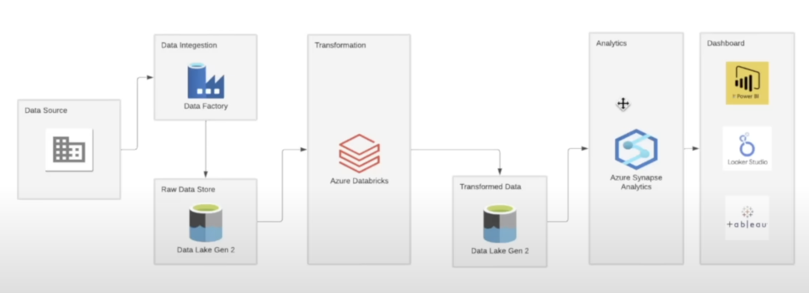
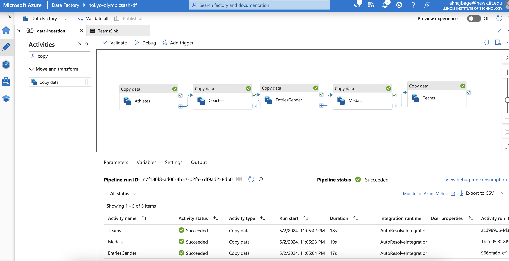
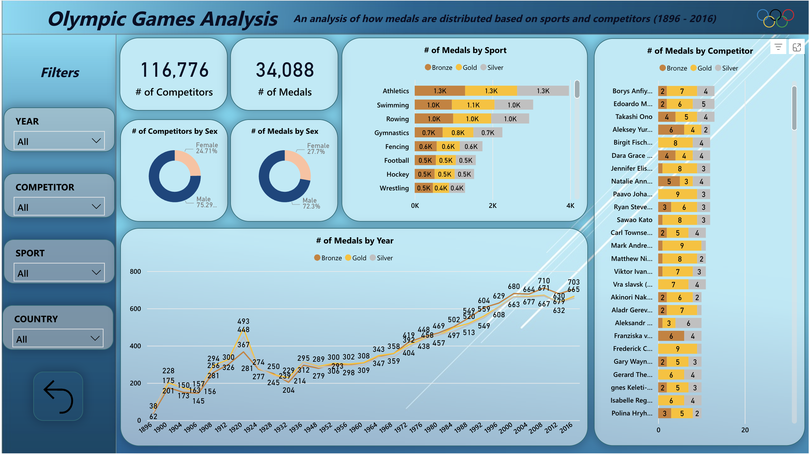

# Tokyo Olympic Azure Data Engineering Project

This data Engineering project focuses on the Olympic Games, examining the number of competitors and medals awarded in each edition of the event. The project was conducted using a variety of tools and techniques, including - 
- **Azure DataFactory** for data Ingestion, 
- **Databricks** for Data Transformation & manipulation 
- **Azure Synapsis Analytics** for data Analysis 
-  **Power BI** for visualization 

-------
```
**All Configured on Azure Cloud (Student Supsciption)**
```
-------

### Design Flow



### Data Ingestion 



### Data Visualization

Before building the Power BI dashboard,  This involved cleaning and filtering the data to ensure accuracy and consistency, as well as preparing it for use in Power BI. Once the data was transformed, I built a Power BI dashboard to visualize the data and identify insights.
s




### Workflows & Analysis

During this analysis, I investigated the number of athletes who participated in each edition of the Olympics, as well as the number of medals awarded in different sports and disciplines. By studying this data, I was able to identify several interesting trends and patterns, including changes in the number of sports and disciplines over time and the dominance of certain athletes in specific events.

Overall, this analysis provides a comprehensive overview of the history and evolution of the Olympic Games, as well as valuable insights into athlete performance and sport-level trends. The use of SQL Server and Power BI allowed for efficient data transformation and visualization, and these findings can be used to inform future Olympic planning and strategy, as well as inspire athletes and fans around the world.
